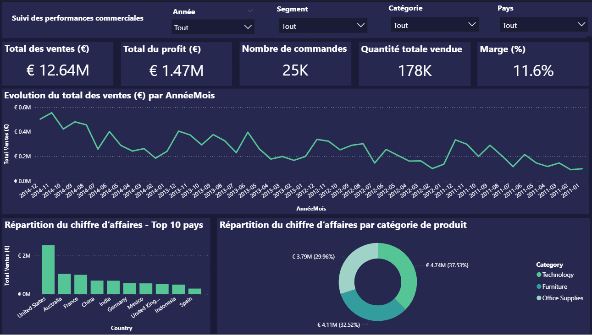
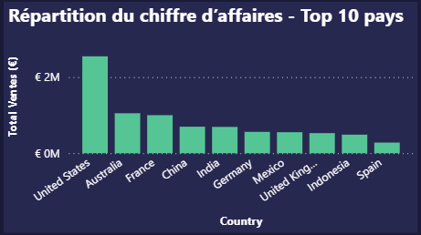
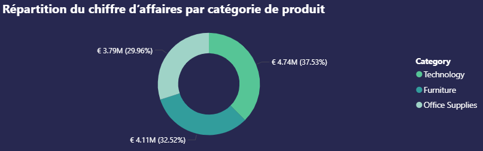
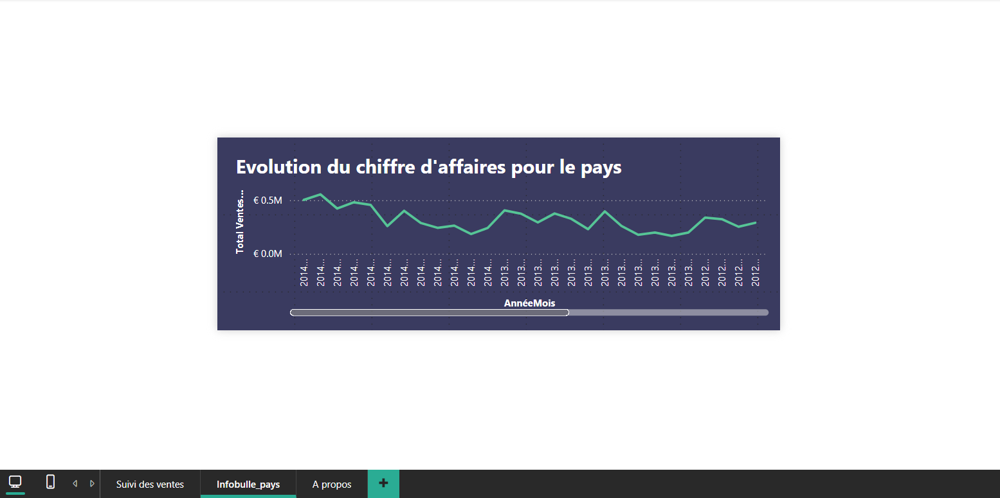

# Projet Power BI - Global Superstore Dashboard  
Analyse complète des ventes, profits, segments clients et performances commerciales

---

## Aperçu du projet  
Ce projet présente un **dashboard Power BI interactif** construit à partir du dataset **Global Superstore** (Kaggle).  
Il permet d'analyser les performances commerciales d'une entreprise fictive à travers des indicateurs clés :

- Total des ventes (€)  
- Total du profit (€)  
- Quantité totale vendue  
- Nombre de commandes  
- Marge (%)  
- Top 10 des pays par chiffre d’affaires  
- Répartition par catégorie de produit  
- Analyse mensuelle de l’évolution des ventes  
- Filtres dynamiques (année, segment, catégorie, pays)

---

## Structure du repository

```
powerbi-global-superstore-dashboard
 ┣ images
 │  ┣ dashboard_overview.png
 │  ┣ top10_countries.png
 │  ┣ category_sales.png
 │  ┣ filters.png
 │  ┗ tooltip_page.png
 ┣ Global_Superstore_Dashboard.pbix
 ┣ Global_Superstore2.csv
 ┗ README.md
```

---

## Aperçu du dashboard

### Vue générale  


### Top 10 pays par chiffre d’affaires  


### Répartition du CA par catégorie  


### Filtres dynamiques  


### Page d'infobulle personnalisée  


---

## Processus de création du dashboard

### 1️⃣ Préparation des données  
- Import du fichier CSV  
- Nettoyage et renommage des colonnes  
- Création d’une table de dates (`CALENDARAUTO()`)  
- Création des dimensions : Clients, Produits, Dates  
- Mise en place d’un modèle en étoile

### 2️⃣ Création des mesures DAX  
Quelques exemples :  

```DAX
Total Ventes (€) = SUM(Fact_Ventes[Sales])

Total Profit (€) = SUM(Fact_Ventes[Profit])

Quantité Vendue = SUM(Fact_Ventes[Quantity])

Marge (%) = DIVIDE([Total Profit], [Total Ventes])
```

### 3️⃣ Visualisations principales  
- Cartes KPI (ventes, profit, commandes, marge)  
- Courbe d’évolution mensuelle  
- Bar chart Top 10 pays  
- Donut chart par catégorie de produit  
- Page d’infobulle dynamique (tooltip)

### 4️⃣ Interaction et UX  
- Filtres multi-dimensionnels  
- Ordre chronologique corrigé avec colonne `AnnéeMoisNum`  
- Mise en forme professionnelle (thème sombre, couleurs harmonisées)

---

## Page "À propos" intégrée au dashboard  

Contenu résumé :

**Objectif du rapport :** analyser les ventes, identifer les meilleurs pays, comparer les catégories, suivre les indicateurs clés  
**Données :** Global Superstore (2011–2014)
**Auteur :** Mohamed Lamine OULD BOUYA – Ingénieur Data / Data Analyst
**Compétences mises en œuvre :** Modélisation en étoile, Power Query, DAX, UX Power BI, visualisations dynamiques

---

## Contact  
**Portfolio :** https://momo3972.github.io/Portfolio-Data-IA  
**GitHub :** https://github.com/Momo3972  
**LinkedIn :** https://linkedin.com/in/mohamed-lamineould-bouya-ab4652211b 
